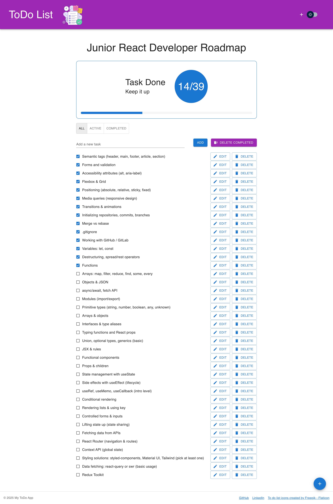

# 📝 ToDo List App

A simple and stylish ToDo application built with **React**, **TypeScript**, and **Material UI (MUI)**.  
You can easily add, edit, delete, and filter your tasks — all with local storage support and theme switching 🌗

---

## 🚀 Demo

🔗 [Live Demo on Vercel](https://todo-list-lilac-pi-77.vercel.app/)

---

## 📸 Preview



---

## ⚙️ Features

✅ Add, edit, delete tasks  
✅ Mark tasks as completed  
✅ Clear completed tasks  
✅ LocalStorage — your tasks stay saved  
✅ Dynamic counter of completed / total tasks  
✅ Confetti 🎉 animation when you finish all tasks  
✅ Light & Dark mode (automatic theme switching)  
✅ Fully responsive layout (mobile & desktop)  
✅ Keyboard shortcuts:

- **Enter** → add new task
- **Esc** → cancel edit mode

---

## 💡 Tech Stack

<div>
  
  
  
  
</div>

---

## 🧠 How It Works

- All todos are stored in the browser’s **LocalStorage**
- `useTodos` custom hook manages:
  - adding / editing / deleting / toggling tasks
  - counting completed items
  - clearing completed tasks
- Theme switching handled with **MUI ThemeProvider**
- Progress and confetti controlled via the **Hero** component

---

## 🛠 Installation & Setup

```bash
# Clone the repo
git clone https://github.com/yourusername/todo-list.git

# Move to folder
cd todo-list

# Install dependencies
npm install

# Start the project
npm run dev
```
